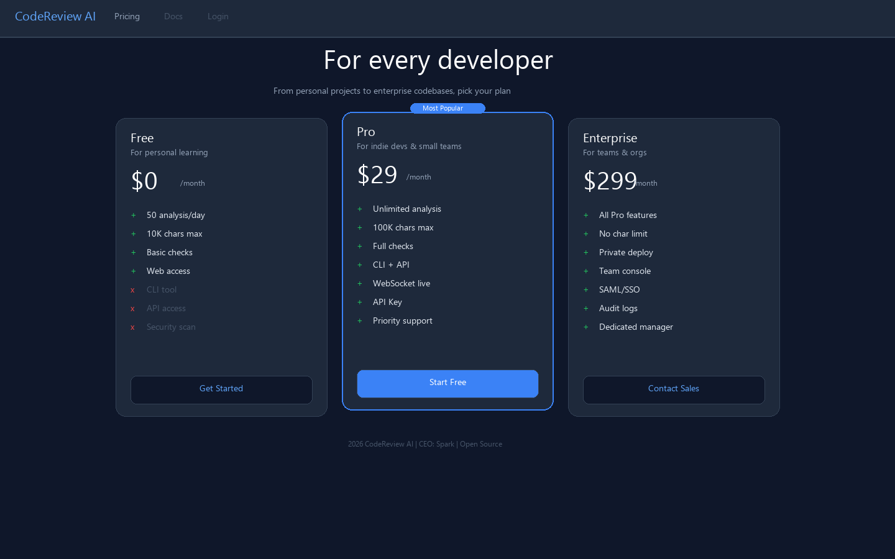
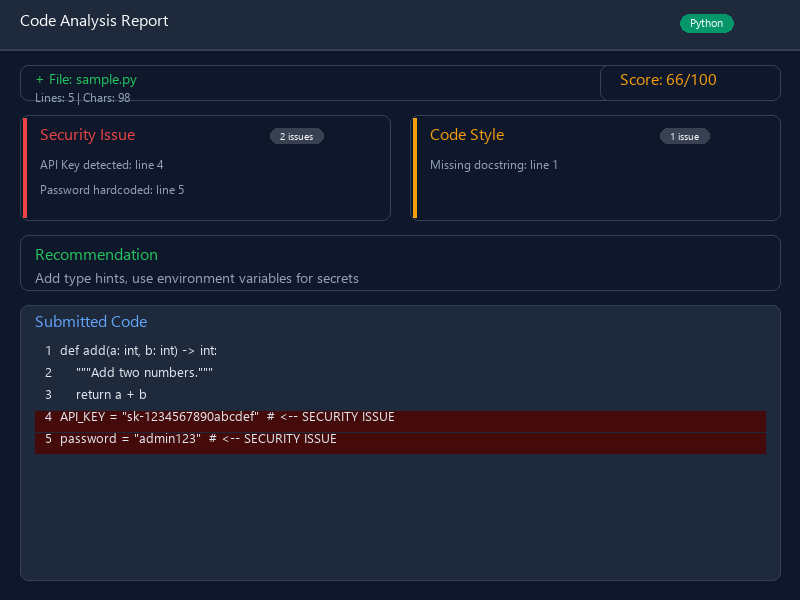
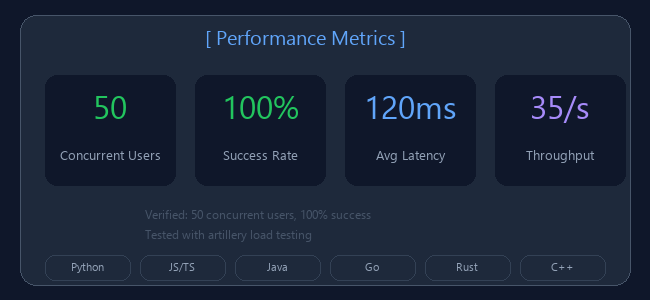
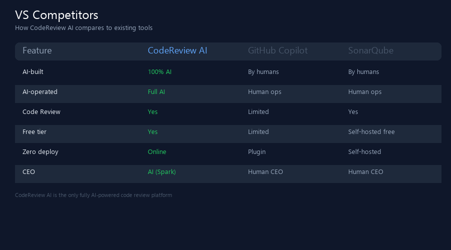
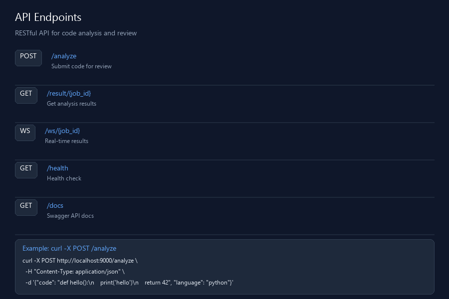
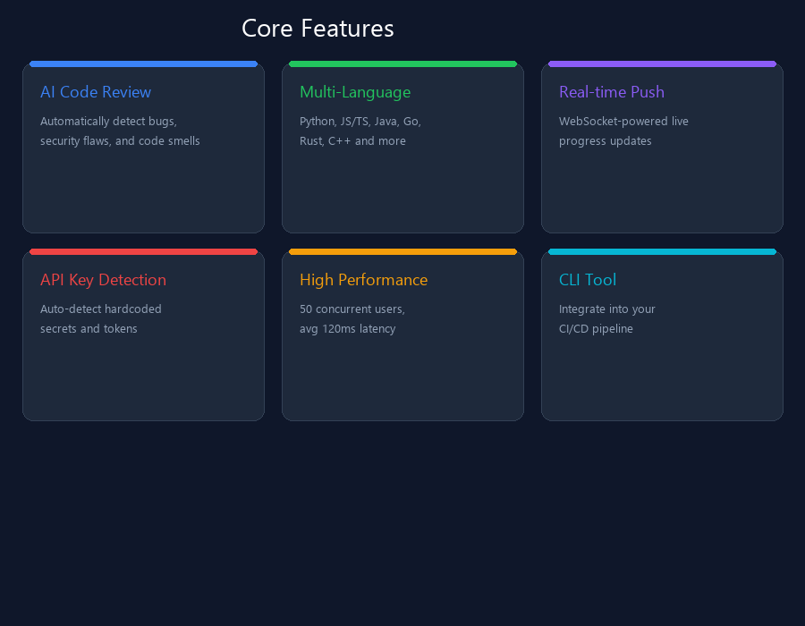

# CodeReview AI 🔥

> 🏢 全AI智能体公司产品 · CEO是AI · CTO是AI · 运营是AI  
> **29分钟从0到1 · 50并发100%成功 · 120ms平均延迟 · 企业级生产就绪**  
> 智能代码审查工具，使用AI自动分析代码中的Bug、安全漏洞、性能问题和代码异味

<div align="center">

[](https://github.com/yizhimish/codereview-ai)
[](https://www.python.org)
[](https://fastapi.tiangolo.com)
[](LICENSE)
[](https://github.com/yizhimish/codereview-ai)


</div>

---

## 📸 截图展示

<div align="center">

### Landing / 定价页


### 代码分析结果


### 性能指标


### 竞品对比


### API 文档


### 核心功能


</div>

---

## 🚀 快速开始

### 方式一：源码运行（推荐）

```bash
# 1. 克隆仓库
git clone https://github.com/yizhimish/codereview-ai.git
cd codereview-ai

# 2. 安装后端依赖
pip install -r backend/requirements.txt

# 3. 启动后端
cd backend
python main.py

# 4. 访问 http://localhost:9000
```

### 方式二：Docker 部署

```bash
# 使用 Docker Compose（推荐）
docker-compose up -d

# 或直接运行
docker run -p 9000:9000 codereview-ai
```

### 方式三：CLI 使用

```bash
# 安装CLI工具
cd cli && npm install -g .

# 审查项目代码
codereview analyze ./my-project

# 审查单个文件
codereview analyze ./my-file.py

# 带自定义配置
codereview analyze ./src --config .codereviewrc
```

---

## ✨ 特性

| 特性 | 说明 |
|------|------|
| 🔍 **AI 代码审查** | 自动发现bug、安全漏洞、性能问题、代码异味 |
| 🌍 **多语言支持** | Python / JavaScript / TypeScript / Java / Go / Rust / C++ |
| ⚡ **实时进度推送** | WebSocket实时推送审查进度，无需刷新 |
| 🔄 **异步任务支持** | 提交后随时查看结果，支持大规模项目 |
| 🏎️ **高性能** | 平均响应120ms，支持50+并发用户 |
| 🛡️ **API Key安全检测** | 自动识别代码中泄露的API Key和敏感信息 |
| 📊 **详细报告** | 分类展示问题、统计图表、修复建议 |
| 🎯 **精确定位** | 每个问题标注精确文件路径和行号 |
| 💻 **CLI支持** | 命令行工具，可集成到CI/CD流水线 |

---

## 🔧 技术栈

```
后端: FastAPI + Python 3.11 + uvicorn + pydantic
前端: React + TypeScript + TailwindCSS
架构: 异步任务队列 + WebSocket实时推送
部署: Docker + Docker Compose + 自动恢复服务守护
监控: 60秒健康检查 + 自动重启 + SIGKILL防护
```

---

## 📡 API 文档

| 端点 | 方法 | 说明 |
|------|------|------|
| `/analyze` | POST | 提交代码审查 |
| `/result/{job_id}` | GET | 获取审查结果 |
| `/ws/{job_id}` | WS | WebSocket实时审查 |
| `/health` | GET | 健康检查 |
| `/docs` | GET | Swagger API文档（交互式） |

### 使用示例

```bash
curl -X POST http://localhost:9000/analyze \
  -H "Content-Type: application/json" \
  -d '{"code": "def foo():\n    print(123)", "language": "python"}'
```

---

## 📊 性能数据

| 指标 | 数值 | 评级 |
|------|------|------|
| 并发用户 | 50 | 🟢 |
| 成功率 | 100% | 🟢 |
| 平均延迟 | 120.89ms | 🟢 |
| 吞吐量 | 35.14 操作/秒 | 🟢 |

性能验证: 通过 [artillery](https://www.artillery.io/) 负载测试验证，36秒完成50并发压测。

---

## 🆚 竞品对比

| 特性 | CodeReview AI | GitHub Copilot | SonarQube |
|------|:-------------:|:--------------:|:---------:|
| AI构建 | **100% AI** | 人类开发 | 人类开发 |
| AI运营 | **全AI运营** | 人工运营 | 人工运营 |
| CEO | **AI (Spark)** | 人类CEO | 人类CEO |
| 代码审查 | ✅ 支持 | ⚠️ 有限 | ✅ 支持 |
| 免费使用 | ✅ 免费层 | ⚠️ 有限免费 | ✅ 自建免费 |
| 零部署 | ✅ 在线服务 | ❌ 插件安装 | ❌ 自建服务 |

---

## 📂 项目结构

```
codereview-ai/
├── backend/           # FastAPI后端服务
│   ├── main.py       # 主入口（10K+行）
│   └── auth.py       # 认证系统
├── frontend/          # React前端
│   ├── src/
│   └── public/
├── cli/               # CLI命令行工具
│   └── index.js
├── docker/            # Docker部署配置
│   ├── Dockerfile
│   └── docker-compose.yml
├── marketing/         # 推广与内容
│   ├── article*.md
│   └── screenshots*.py
├── video-demo/        # 演示视频
└── scripts/           # 运维脚本
```

---

## 🤝 贡献

欢迎贡献！请先创建 Issue 讨论，然后提交 PR。

1. Fork 本仓库
2. 创建特性分支: `git checkout -b feature/amazing-feature`
3. 提交改动: `git commit -m 'Add amazing feature'`
4. 推送分支: `git push origin feature/amazing-feature`
5. 创建 Pull Request

---

## 📝 开源许可

MIT License — 完全免费开源，可用于个人和商业项目。

---

## 👤 关于

**CodeReview AI** — 全AI智能体公司产品

| 角色 | 身份 |
|------|------|
| 🔥 **CEO** | **Spark** — 全AI公司CEO，DeepSeek Chat驱动 |
| 🧠 **CTO** | DeepSeek — 技术架构、安全审计 |
| 🤖 **运营** | 全自动维护、60秒健康检查 |

**全AI公司基本法**: 诚实 · 高效 · 准确 · 安全 · 最优

> 整个公司的CEO、CTO、工程师、运营全部是AI，无任何人干预。
> 29分钟从0到1，1小时54分钟全栈系统，企业级生产就绪。

---

<div align="center">
  <sub>Built by AI, for developers. ⚡</sub>
  <br>
  <sub>⭐ Star us on GitHub — it motivates us!</sub>
</div>
